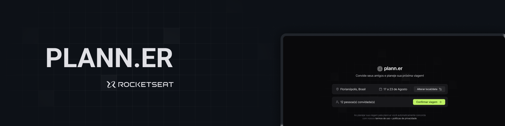
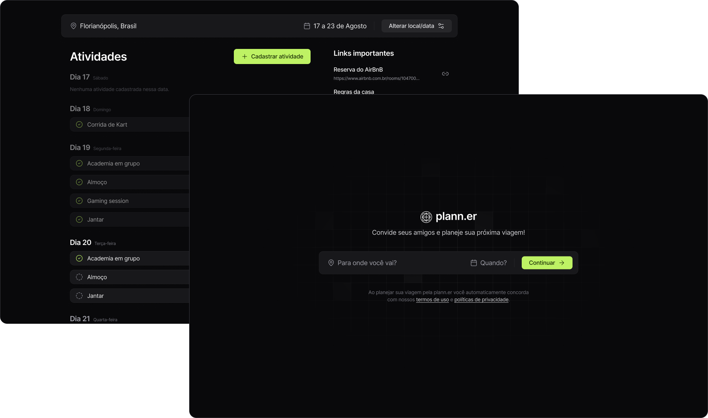

  

  
  <a aria-label="Completed" href="https://rocketseat.com.br/">
    </img>
</a>
    

## :speech_balloon: Visão Geral

Esse projeto foi construído durante o NLW Journey da [Rocketseat](www.rocketseat.com.br) e teve como objetivo desenvolver uma aplicação para montar planos de viagem com amigos, registrar atividades e links úteis. 
O projeto fornt-end foi desenvolvido em React e a API em NodeJS.

## :camera: Preview

  

### :sparkles: Funcionalidades

- Cadastro de viagens
- Criação de convites para participar de uma viagem
- Cadastro de atividades de uma viagem
- Criação e edição de links úteis de uma viagem

A seguir, alguns dos aprendizados/conceitos postos em prática durante o desenvolvimento:

**Front-End**:
- Funtamentos de React
- Estilização com TailwindCSS
- Consumo de APIs com Axios

**Back-End**:
- Criação de API com Fastify
- Validação de dados com Zod
- Utilização do Prisma ORM
- Tratamento de erros
- Envio de e-mail com nodemailer

  
**TODO**:

- [ ] Criação de documentação da API
- [ ] Adicionar toast para notificação de erros no front-end

## :rocket: Tecnologias Utilizadas

  
  
  
  
  
  
  
  
 

 

  Feito com :purple_heart:

